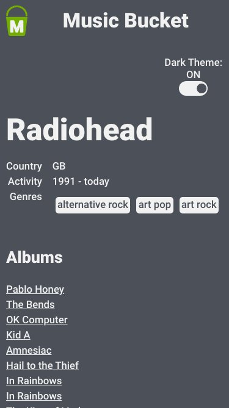

<section align='center'>
  
  <h1 align='center'>Music Bucket</h1>
  <a href="https://github.com/leo606/MusicBucket">Source Code</a> •
  <a href="https://music-bucket.vercel.app">Application</a>
</section>

## Tabela de conteúdos
  * [**Sobre o projeto**](#Sobre)
  * [**Layout**](#Layout)
    * [Desktop](#Desktop)
    * [Mobile](#Mobile)

## Sobre
  Music Bucket é um front end que consome a API do [MusicBraiz](https://musicbrainz.org/doc/MusicBrainz_API) para procurar e listar artistas e albums, mostrando informações sobre o ítem procurado, como data de lançamento e track list.
  Projeto desenvolvido para praticar tecnologias de front-end como React, Redux e Styled Components.

## Layout
  ### Desktop
  

    
     
    
  

  ### Mobile
  

    
    
  

## kajsdhfkjsdhf
  Music Bucket é um front end que consome a API do [MusicBraiz](https://musicbrainz.org/doc/MusicBrainz_API) para procurar e listar artistas e albums, mostrando informações sobre o ítem procurado, como data de lançamento e track list.
  Projeto desenvolvido para praticar tecnologias de front-end como React, Redux e Styled Components.